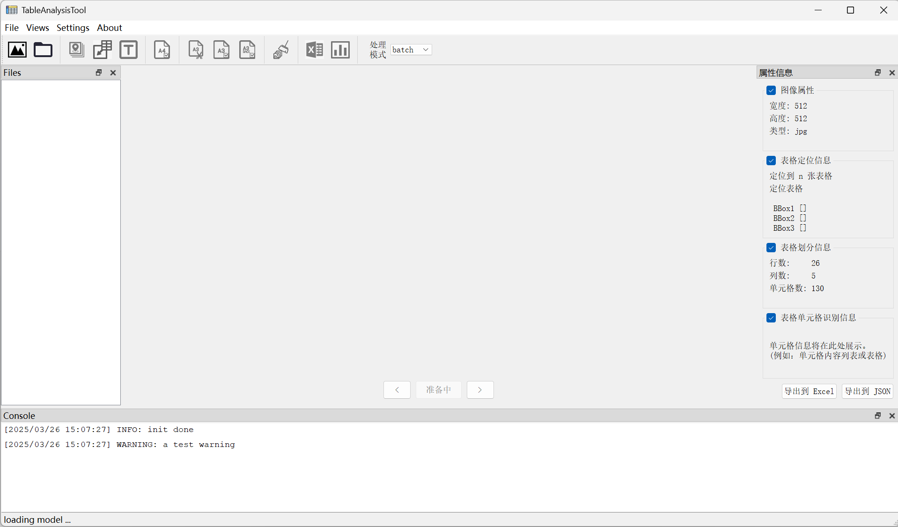

本仓库是针对一个问卷表格自动统分需求开发的一个OCR工具。主要分为两个部分

1. 表格检测与表格解析（通用模块）

2. 表格统分

> 两部分耦合低，基于表格检测与表格解析部分，方便适配和开发其他业务逻辑

**表格检测与解析**: 采用百度 PPStructure 和微软 table-transformer 等先进算法，精准地从图像中定位并提取表格结构。

**表格统计**: 基于百度PaddleOCR 进行文本识别，并结合微调的 Yolov8n-cls 模型处理对号等特殊符号，实现高效准确的表格数据统计。

UI使用PyQt搭建，软件界面如下

<center>

</center>

- 支持单张图像处理、批量处理
- 支持cuda/cpu推理

## 环境搭建

> 虽然我们提供了 requirements.txt
> 但可能由于平台问题以及很多自定义安装，我们建议按照下面的过程执行，并参考requirements.txt 相关库版本

1. 创建环境
```bash
conda create -n tableAnalysis python=3.8 -y
conda activate tableAnalysis
```

2. 安装依赖
```bash
# 一定要按照以下顺序安装相关工具
pip install pyqt5-sip==12.11.0
pip install pyqt5==5.15.9
pip install pyqt5-tools
```

```bash
# torch-gpu
pip install torch==2.2.1 torchvision==0.17.1 torchaudio==2.2.1 --index-url https://download.pytorch.org/whl/cu118

# paddle-gpu (windows)
python -m pip install paddlepaddle-gpu==2.4.2.post117 -f https://www.paddlepaddle.org.cn/whl/windows/mkl/avx/stable.html
# paddle-gpu (linux)
python -m pip install paddlepaddle-gpu==2.4.2.post117 -f https://www.paddlepaddle.org.cn/whl/linux/mkl/avx/stable.html
```

```bash
cd PaddleOCR-2.7.0
python install -e .
```

```bash
pip install transformers==4.46.3
pip install accelerate==1.0.1
pip install hf-transfer

pip install numpy==1.24.4 opencv-python==4.6.0.66 pillow==10.4.0 pandas==2.0.2
pip install openvino==2024.4.0
pip install onnxruntime==1.19.2
```

3. 启动
```bash
python app.py
```
windows下如果需要.bat启动 替换其中的python.exe 环境路径

## 相关博客

1. [OCR实践—PaddleOCR](https://blog.csdn.net/csy1021/article/details/144518451?spm=1001.2014.3001.5502)
2. [OCR实践-Table-Transformer](https://blog.csdn.net/csy1021/article/details/144742974?spm=1001.2014.3001.5502)
3. [OCR实践-问卷表格统计](https://blog.csdn.net/csy1021/article/details/144777615?spm=1001.2014.3001.5501)

## 反馈与沟通

希望我们的代码能对你有所帮助，如有问题 欢迎提交issue

同时，你可以在以下平台找到我们

<table>
  <tr>
    <td></td>
    <td></td>
  </tr>
  <tr>
    <td>tim/qq</td>
    <td>wechat</td>
  </tr>
</table>
